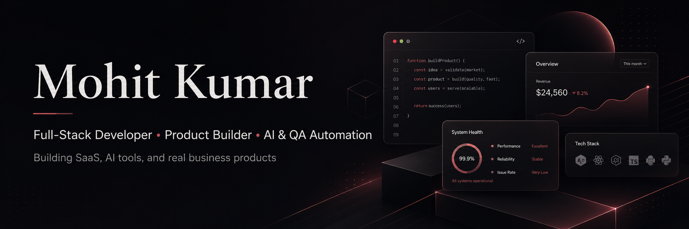

# Mohit Kumar

  

Full-stack developer building SaaS products, AI tools, QA automation systems, and practical business software.

---

## Current Focus

- SaaS products and business platforms
- AI-assisted developer workflows
- QA automation and browser testing
- Product dashboards and admin systems
- Clean full-stack web applications

---

## Projects

| Project | What it does | Stack |
|---|---|---|
| **[QaAgent](https://github.com/BAKUGOS1/QaAgent)** | Website QA agent with browser testing, memory, and reports. | TypeScript, Playwright |
| **[Hinglishtech](https://github.com/BAKUGOS1/Hinglishtech)** | Beginner-friendly Python learning project. | TypeScript, Python |
| **[Code Momentum 2025](https://github.com/BAKUGOS1/code-momentum-2025)** | Git activity streak analyzer with CLI reports and CI. | Python, GitHub Actions |
| **[vedic](https://github.com/BAKUGOS1/vedic)** | Minimal portfolio and brand experience. | TypeScript |
| **[npmsearch](https://github.com/BAKUGOS1/npmsearch)** | Fast npm package discovery interface. | TypeScript |
| **[dsbored121](https://github.com/BAKUGOS1/dsbored121)** | Study room and productivity app concept. | TypeScript, Next.js |

---

## Tech

  
  
  
  
  
  
  
  
  
  

---

<h2 align="center">GitHub Activity</h2>

  
  
  

  

---

  <a href="https://github.com/BAKUGOS1/QaAgent">QaAgent</a> |
  <a href="https://github.com/BAKUGOS1/code-momentum-2025">Code Momentum 2025</a> |
  <a href="https://github.com/BAKUGOS1/npmsearch">npmsearch</a>

